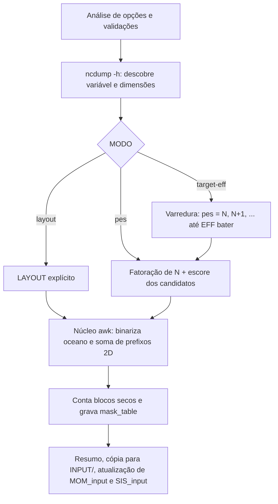

# domain-mom6.bash: decomposição de domínio do MOM6+SIS2

INPE / CGCT / DIMNT, Grupo de Trabalho para Acoplamento de Modelos (GTA).

Documento de referência do algoritmo implementado em `domain-mom6.bash`. O script
calcula um `LAYOUT` (NIPROC x NJPROC) equilibrado, gera o `mask_table` do FMS e,
opcionalmente, atualiza `MOM_input` e `SIS_input`. A implementação é 100% shell:
`ncdump` (módulo `cray-netcdf`) para ler o NetCDF e `awk` (POSIX) para toda a
aritmética, sem dependência de Python, numpy ou netCDF4.

---

> **Restrição do sistema acoplado.** O `mask_table` **não é utilizável** com o
> cap NUOPC atual do MOM6. Use `--no-mask` no acoplado; o `mask_table` continua
> válido para o MOM6+SIS2 standalone. Resumo do porquê na seção 2, explicação
> completa em `mascara-cap-nuopc.md`.

## 1. Problema que o script resolve

No MOM6 o domínio horizontal global (NI_G x NJ_G pontos) é fatiado em
NIPROC x NJPROC blocos retangulares. Cada bloco consome um PE. Como boa parte da
grade global é continente, muitos blocos são **100% terra** e não precisam de
processador. O FMS lê um arquivo `mask_table` que lista esses blocos e os elimina
da decomposição:

```
PETs efetivos (EFF) = NIPROC * NJPROC - Nmask
```

É esse valor `EFF`, e não o produto NIPROC*NJPROC, que o componente MOM6+SIS2
exige receber do acoplador. Se houver discrepância, o FMS aborta com:

```
fms2_io(parse_mask_table_2d): mpp_npes() .NE. layout(1)*layout(2) - nmask
```

**Atenção ao modo de execução do acoplador:**

| `pet_layout` (`&nuopc_petlayout`) | Valor que EFF deve igualar |
|---|---|
| `shared` (sem split de comunicador) | total de PETs do run (`-n`) |
| `split` (blocos disjuntos ATM \| OCN) | apenas `ocn_pet_count`, a fatia do OCN |

Repare que quem manda aqui é o **layout**, não o `coupling_mode`. Desde a
v14.20 os dois eixos são independentes, e `sequential + split` também entrega ao
OCN apenas a sua fatia — antes disso, `sequential` implicava `shared`, e a tabela
podia ser lida como se falasse de modos de execução.

O script não sabe qual arquitetura está em uso: quem chama `--target-eff` informa
o N correspondente aos PETs que o OCN vai efetivamente receber.

### Ilustração

Grade 8 x 4 com `LAYOUT = 4, 2` (8 blocos). Os blocos marcados com `T` são 100%
terra e entram no `mask_table`:

```
        i ->  1     2     3     4        LAYOUT 4 x 2
            +-----+-----+-----+-----+
  j = 2     |  T  |  ~  |  ~  |  ~  |    Nmask = 2
            +-----+-----+-----+-----+    EFF   = 8 - 2 = 6
  j = 1     |  ~  |  ~  |  T  |  ~  |
            +-----+-----+-----+-----+    ~ = tem ao menos 1 ponto de oceano
```

`mask_table` correspondente:

```
2
4,2
1,2
3,1
```

---

## 2. Por que o acoplado não aceita `mask_table`

Resumo, com a explicação completa em `mascara-cap-nuopc.md`.

O cap `mom_cap_MONAN.F90` descreve a grade do oceano ao ESMF com um
`ESMF_DistGridCreate` que declara o espaço de índices completo
(`minIndex=(1,1)`, `maxIndex=(NI_G,NJ_G)`) e o reparte com um `deBlockList`
montado a partir de `mpp_get_compute_domains`, ou seja, apenas com os blocos que
têm PE. Os blocos mascarados ficam de fora e o espaço declarado passa a ter
regiões sem dono.

Nada valida essa cobertura na criação do objeto. A falha aparece bem depois, no
conector `OCN-TO-MED`, quando o `ESMF_FieldRegridStore` converte a Grid em Mesh
e precisa saber o dono de cada célula:

```
ERROR  ESMCI_Mesh.C, line:1786: Bad processor number!
       ESMF_GridToMesh <- ESMF_FieldRegridStoreNX <- OCN-TO-MED  Phase 'IPDv05p6b'
```

Em seguida vem o SIGSEGV, num PET vizinho ao buraco. O MOM6 e o FMS não têm
parte nisso: a inicialização deles conclui normalmente, inclusive lendo o
`mask_table`. O split de comunicador entre atmosfera e oceano também não tem
relação com o problema.

**Enquanto isso.** Use `--no-mask` no sistema acoplado. O `mask_table` continua
válido para o MOM6+SIS2 standalone, observada a ressalva da seção 5.

## 3. Fluxo geral



---

## 4. Leitura da topografia

### 4.1 Descoberta da variável e das dimensões (`ncdump -h`)

O cabeçalho é lido uma única vez. A variável é procurada na ordem
`--depth-var`, `depth`, `D`, `wet`, `mask`. Se nenhuma existir, o script lista
as variáveis disponíveis e encerra.

As dimensões da variável são extraídas da declaração e as **duas últimas** são
interpretadas como `(j, i)`, ou seja, `(NJ_G, NI_G)`. Essa convenção torna o
script robusto a nomes de dimensão arbitrários (`ny,nx`, `lat,lon`, `grid_y,grid_x`).

### 4.2 Critério de oceano

| Tipo de variável | Limiar (THRESH) | Regra |
|---|---|---|
| Profundidade (`depth`, `D`) | `--min-depth` (padrão 0) | oceano se valor > THRESH |
| Máscara (`wet`, `mask`) | 0,5 | oceano se valor > 0,5 |

Valores de preenchimento (`_` na saída do `ncdump`) são tratados como terra.

### 4.3 Binarização

O núcleo em `awk` percorre a saída de `ncdump -v VAR`, localiza o início do bloco
de dados (`VAR = ...`), acumula tokens até o `;` final e produz o vetor
`ocean[0..NI_G*NJ_G-1]` com valores 0 (terra) ou 1 (oceano). Se a contagem de
valores lidos não bater com NI_G*NJ_G, um aviso é emitido.

---

## 5. Núcleo do algoritmo: soma de prefixos 2D

O custo dominante seria contar pontos de oceano dentro de cada bloco candidato.
Para evitar isso, o script constrói **uma única vez** uma soma de prefixos 2D
(imagem integral) do campo binário:

```
PS[j][i] = ocean(i-1, j-1) + PS[j-1][i] + PS[j][i-1] - PS[j-1][i-1]
```

com `PS[0][*] = PS[*][0] = 0`. Armazenada de forma linearizada em
`PS[j*W + i]`, `W = NI_G + 1`.

Com ela, a contagem de oceano em qualquer retângulo `[i0,i1) x [j0,j1)` custa
O(1), pelo princípio da inclusão e exclusão:

```
rectsum = PS[j1][i1] - PS[j0][i1] - PS[j1][i0] + PS[j0][i0]
```

```
        i0        i1
    +----+---------+
 j0 |  A |    B    |        soma(D) = PS(j1,i1) - PS(j0,i1)
    +----+---------+                          - PS(j1,i0) + PS(j0,i0)
    |  C |    D    |
 j1 +----+---------+
```

Um bloco é 100% terra quando `rectsum == 0`.

### Fronteiras dos blocos (`bounds`)

A partição de `n` pontos em `parts` blocos é contígua e balanceada: os primeiros
`n mod parts` blocos recebem um ponto a mais, de modo que os tamanhos difiram em
no máximo 1. Não há sobreposição nem lacuna.

> **Ressalva em aberto: a convenção não é a mesma do FMS.** O `mpp_compute_extent`
> distribui as sobras de forma **simétrica**, e não nos primeiros blocos. Para
> 158 pontos em 3 blocos, o FMS imprime `Y-AXIS = 53 52 53` enquanto o script
> calcula `53 53 52`. As fronteiras internas ficam deslocadas em um ponto, e o
> conjunto de blocos secos pode divergir:
>
> | LAYOUT | Marcado só pelo script | Seco só no FMS |
> |:---|:---|:---|
> | 43x3 | (idênticos) | (idênticos) |
> | 15x9 | (8,8) | (9,7) |
> | 16x8 | (9,6) e (15,4) | (9,7) |
>
> A consequência é séria **no uso standalone**: o script pode mascarar um bloco
> que, na decomposição real do FMS, contém oceano, e esse oceano sai
> silenciosamente do modelo. No acoplado com `--no-mask` o efeito é nulo, pois
> nenhum `mask_table` é lido e o desalinhamento afeta apenas a contagem
> informativa de blocos secos.
>
> A distribuição simétrica do FMS está comprovada pelo log (`53 52 53`); o
> algoritmo exato para outros casos ainda não foi verificado contra o fonte do
> `mpp_domains_mod`. **Antes de usar um `mask_table` gerado por este script em
> execução standalone**, confira os eixos impressos pelo FMS na inicialização
> contra os blocos listados no arquivo.

---

## 6. Modos de operação

### 6.1 `--layout NI,NJ` (explícito)

Usa a forma informada, apenas validando que não excede a grade. Não há busca.

### 6.2 `--pes N` (sugestão de LAYOUT)

1. Fatora N em todos os pares `(a, b)` com `a*b = N`.
2. Atribui um escore a cada par, considerando o tamanho do bloco
   `ti = NI_G/a`, `tj = NJ_G/b`:

```
escore = razão_de_aspecto + (0,5 se a divisão não for exata) + 1000 se reprovado no filtro
razão_de_aspecto = max(ti,tj) / min(ti,tj)
reprovado = min(ti,tj) < --min-tile  ou  razão_de_aspecto > --max-aspect
```

O filtro de forma tem dois parâmetros, ambos com padrão calibrado pelo
incidente do `LAYOUT 43x3`:

| Opção | Padrão | Motivo |
|---|---|---|
| `--min-tile` | 9 pontos | `2*NIHALO+1`, o halo do domínio `MOM_MOSAIC` (supergrade). Bloco menor que o halo faz o FMS ler além do domínio do vizinho |
| `--max-aspect` | 4,0 | blocos-fita maximizam a área de halo por área útil |

A penalidade de 1000 é proibitiva, mas não elimina o candidato da tabela: ele
aparece marcado como `reprovado` e só é escolhido se nenhum outro sobreviver
(nesse caso o script avisa).

3. Ordena e avalia os **6 melhores** candidatos, calculando `Nmask` e `EFF` de
   cada um pela soma de prefixos. Todos são exibidos em tabela, e o primeiro
   (menor escore) é o escolhido.

O escore favorece blocos próximos de quadrados (melhor razão entre área de halo
e área útil), penaliza divisões inexatas (blocos de borda desiguais) e penaliza
fortemente blocos muito pequenos, onde o halo domina o custo de comunicação.

### 6.3 `--target-eff N` (busca por EFF exato)

O número de blocos mascarados depende da **forma** do LAYOUT, não apenas do
produto NIPROC*NJPROC. Logo, não existe fórmula fechada para obter um EFF alvo.
O script varre:

```
para p = N, N+1, ..., N + search_range (padrão 40):
    executa o núcleo em modo "scan" com PES = p
    o awk devolve TODOS os pares de fatores de p que passam no filtro de forma,
    cada um com escore, nmask e EFF
    guarda os que tiverem EFF == N
vence o de menor escore em toda a faixa
```

Duas decisões de projeto, ambas consequência do incidente do `LAYOUT 43x3`:

1. **Não se aceita o primeiro EFF que bate.** A varredura percorre a faixa
   inteira e compara. Antes, o script parava no primeiro acerto, e como
   `43x3` (blocos de 4,2 pontos) aparecia em `p = 129`, ele vencia o `15x9`
   (blocos de 12,0 x 17,6) que só surge em `p = 135`.
2. **Avaliam-se todos os pares de fatores de cada `p`**, não apenas o melhor
   deles. O vencedor global pode não ser o melhor candidato do seu próprio
   número de blocos, e por isso o fluxo segue como `--layout` explícito, com o
   par já resolvido.

Se nada sobreviver, o script sugere ampliar `--search-range`, relaxar
`--min-tile` ou `--max-aspect`, ou usar `--no-mask`.

Esse modo é exclusivo e não pode ser combinado com `--pes` ou `--layout`.

---

### 6.4 `--no-mask` (sem `mask_table`)

Modo recomendado para o sistema acoplado. Escolhe o melhor `LAYOUT` cujo produto
`NIPROC * NJPROC` seja exatamente o número de PETs pedido, com os mesmos filtros
de forma, e **não grava** `mask_table`:

- `EFF = NIPROC * NJPROC` (nenhum bloco é eliminado);
- os blocos 100% terra são apenas informados, e cada um recebe um PET;
- se `--mom-input`/`--sis-input` forem usados, uma diretiva `MASKTABLE`
  remanescente é **comentada** com `!`, já que apontaria para um arquivo
  incompatível com o novo `LAYOUT`.

`--no-mask` combinado com `--target-eff N` equivale a `--pes N`, e o script faz
essa conversão automaticamente.

## 7. Saída

### 7.1 `mask_table` (formato FMS)

```
linha 1 : Nmask (número de blocos mascarados)
linha 2 : NIPROC,NJPROC
demais  : i,j  (índices 1-based de cada bloco 100% terra)
```

O arquivo é escrito diretamente pelo `awk`. O nome padrão é
`mask_table.<Nmask>.<NI>x<NJ>`, sobrescrito por `--out`.

### 7.2 Tabela de candidatos

Nos modos `--pes` e `--no-mask`, o script lista os seis melhores candidatos antes
de decidir:

```
==> [1/2] Candidatos de LAYOUT (ordenados; 1º = escolhido)
       LAYOUT     BLOCO(pts)   EXATO  FILTRO      MASCAR.  PETs
       16x8       11x19        não    ok          7        121
       8x16       22x9         não    ok          5        123
       32x4       5x39         não    reprovado   1        127
       64x2       2x79         não    reprovado   0        128
```

| Coluna | Significado |
|---|---|
| `LAYOUT` | o par `NIPROC x NJPROC`, que vai literalmente para a diretiva `LAYOUT`. `16x8` e `8x16` são candidatos distintos: mesmo número de blocos, orientações opostas |
| `BLOCO(pts)` | tamanho aproximado do bloco, `NI_G/NIPROC` por `NJ_G/NJPROC`, **truncado** para exibição. Em `16x8` os blocos reais têm 11 ou 12 pontos em i e 19 ou 20 em j |
| `EXATO` | a divisão é inteira nas duas direções? `não` significa blocos de borda com um ponto de diferença. Pesa 0,5 no escore |
| `FILTRO` | veredito de `--min-tile` e `--max-aspect`. Usa o valor **fracionário** do bloco, não o truncado: `8x16` exibe `22x9` e passa, porque o valor real é 9,875 |
| `MASCAR.` ou `SECOS` | blocos 100% terra naquele arranjo. Com máscara o rótulo é `MASCAR.` (serão eliminados); em `--no-mask` é `SECOS` (serão mantidos, contagem informativa) |
| `PETs` | processos que o oceano vai pedir: `NIPROC * NJPROC - Nmask` com máscara, ou `NIPROC * NJPROC` em `--no-mask` |

A ordenação não segue nenhuma coluna visível, e sim o escore da seção 6.2. O
primeiro da lista é o escolhido. Note a tendência dos reprovados: blocos-fita
muito compridos quase sempre tocam algum oceano, então o `Nmask` cai a zero, e
era justamente isso que os tornava atraentes antes do filtro de forma existir.

### 7.3 Resumo em tela

Grade e fração de oceano, LAYOUT escolhido, número de blocos de terra com a
economia percentual de PETs, EFF e caminho do `mask_table`, além das linhas
prontas para colar no `MOM_input`:

```
LAYOUT = 16, 8
MASKTABLE = "mask_table.23.16x8"
```

### 7.4 Efeitos colaterais opcionais

| Opção | Efeito |
|---|---|
| `--input-dir DIR` | copia o `mask_table` para `DIR` (tipicamente `INPUT/`) |
| `--mom-input ARQ` | reescreve `LAYOUT` e `MASKTABLE` via `sed`, com backup `ARQ.bak.<timestamp>` |
| `--sis-input ARQ` | idem para o SIS2 |
| `--dry-run` | suprime cópia e edição, mas o `mask_table` ainda é gravado (é o próprio resultado do cálculo) |
| `--no-mask` | não gera `mask_table` e comenta um `MASKTABLE` preexistente |

Se `Nmask = 0`, o `MASKTABLE` não é inserido e um aviso alerta caso a diretiva já
exista no arquivo.

---

## 8. Avisos emitidos

| Condição | Aviso |
|---|---|
| bloco menor que `--min-tile` | halo (`NIHALO` e `2*NIHALO+1` no supergrid) pode exceder o bloco |
| nenhum candidato aprovado no filtro | o LAYOUT escolhido viola `--min-tile`/`--max-aspect` |
| `mask_table` gerado com `nmask > 0` | não suportado pelo cap NUOPC (ver seção 2); use `--no-mask` no acoplado |
| divisão não exata | blocos de borda com tamanho diferente |
| `Nmask = 0` | `mask_table` desnecessário, não defina `MASKTABLE` |
| leitura incompleta | número de valores lidos difere de NI_G*NJ_G |

---

## 9. Custo computacional

Sendo `P` o número de blocos e `C` o número de candidatos avaliados:

| Etapa | Custo |
|---|---|
| Leitura e binarização | O(NI_G * NJ_G) |
| Soma de prefixos | O(NI_G * NJ_G), uma vez por execução do núcleo |
| Avaliação de um LAYOUT | O(P) blocos, cada um O(1) |
| Modo `--target-eff` | uma execução do núcleo por valor de `p` testado |

Observação: no modo `--target-eff` o `ncdump` e a soma de prefixos são refeitos a
cada tentativa. Para grades grandes e faixas de busca amplas, essa é a etapa mais
cara e um ponto natural de otimização futura (reutilizar o array binário entre
tentativas).

---

## 10. Exemplos

```bash
# Sistema acoplado: LAYOUT com produto exato = PETs do OCN, sem mask_table
bash domain-mom6.bash --topog INPUT/ocean_topog.nc --no-mask --pes 128 \
     --mom-input MOM_input --sis-input SIS_input

# Sugerir o melhor LAYOUT para 128 blocos (standalone)
bash domain-mom6.bash --topog INPUT/ocean_topog.nc --pes 128

# LAYOUT explícito
bash domain-mom6.bash --topog INPUT/ocean_topog.nc --layout 16,8

# Run com -n 256 e pet_layout='split' (128 ATM + 128 OCN):
# gera o LAYOUT com EFF exatamente 128 e já atualiza os inputs
bash domain-mom6.bash --topog INPUT/ocean_topog.nc --target-eff 128 \
     --input-dir INPUT --mom-input MOM_input --sis-input SIS_input

# Inspeção sem tocar nos arquivos de configuração
bash domain-mom6.bash --topog INPUT/ocean_topog.nc --target-eff 64 --dry-run
```

---

## 11. Pontos de atenção

1. No sistema acoplado, use `--no-mask`. Um `mask_table` derruba o run no
   conector `OCN-TO-MED` (seção 2), e não na inicialização do MOM6, o que torna
   o sintoma enganoso.
2. `LAYOUT` em `MOM_input` e `SIS_input` deve ser **idêntico** nos dois arquivos,
   assim como o `MASKTABLE`.
3. `EFF` deve casar com os PETs que o OCN recebe, e não com o total do job
   quando `pet_layout = 'split'`. Esse é o erro mais comum na configuração do
   acoplador. O critério é o layout: `sequential + split` também dá ao OCN
   apenas `ocn_pet_count`.
4. O `mask_table` precisa estar no diretório de onde o FMS lê os inputs
   (`INPUT/`), e o nome referenciado em `MASKTABLE` é apenas o basename.
5. Mudou a topografia, a resolução ou o número de PETs do OCN? Regenere o
   `LAYOUT`. Um `mask_table` antigo com Nmask incompatível aborta a execução.
6. No uso standalone, valide o `mask_table` contra os eixos que o FMS imprime na
   inicialização: a convenção de fronteiras do script difere da do
   `mpp_compute_extent` (ressalva da seção 5).
7. Requisitos de ambiente: `module load cray-netcdf` para dispor de `ncdump`.
   O script não depende do `COUPLER_ROOT` nem do ESMF.
