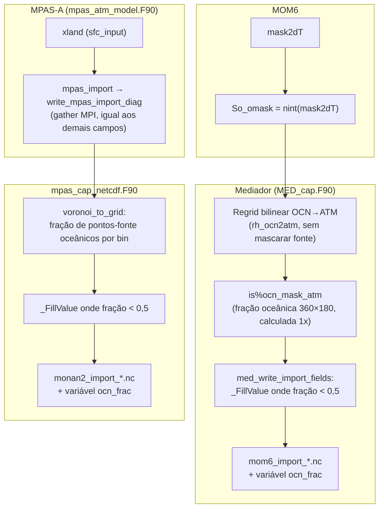

# Máscara de continentes em mom6_import_*.nc e monan2_import_*.nc

Como os dois diagnósticos de importação passaram a gravar `_FillValue` sobre
terra, em vez de um valor fisicamente plausível.

INPE / CGCT / DIMNT, Grupo de Trabalho para Acoplamento de Modelos.
MASCARA-CONT-01 (lado MOM6) e MASCARA-CONT-02 (lado MPAS) — Set/2026.

---

## Em três frases

Até esta revisão, nenhum dos dois diagnósticos de importação sabia, célula a
célula, o que era continente: `mom6_import_*.nc` não mascarava nada, e
`monan2_import_*.nc` só descartava valores fora de uma faixa física, o que não
pega terra porque a célula de terra recebe um valor plausível (SST≈271,35 K).
A correção usa a máscara real de cada modelo — `So_omask` do MOM6 e `xland` do
MPAS — regredida uma única vez para a grade de saída, e grava `_FillValue`
onde a fração de cobertura oceânica fica abaixo de 0,5, junto com essa fração
numa nova variável `ocn_frac`, para que o pós-processamento nunca mais precise
adivinhar a costa por um limiar de temperatura.

---

## 1. O problema que isso resolve

Os dois arquivos de diagnóstico são gerados por regrid/binning de uma grade
nativa (tripolar no MOM6, Voronoi não estruturada no MPAS) para uma grade
regular lat/lon, só para inspeção humana — não fazem parte do ciclo de
acoplamento em si. Nenhum dos dois caminhos de escrita tinha, até aqui, acesso
à geografia real de terra/água na grade de SAÍDA:

| Arquivo | Escrito por | O que existia antes |
|---|---|---|
| `mom6_import_*.nc` | `med_cap_netcdf.F90::med_write_import_fields` | Nada. Os 14 fluxos + `So_t/So_u/So_v/Sf_zorl` saíam sem nenhum `_FillValue` sobre terra. O campo `is%ocn_mask_atm`, que existia para isso, nunca era preenchido. |
| `monan2_import_*.nc` | `mpas_cap_netcdf.F90::write_mpas_import_diag` | Só um filtro de faixa física (`vmin`/`vmax`) em `voronoi_to_grid`, mais um piso `ocean_frac_min` calculado sobre a fração de dado *fisicamente válido* — não sobre a fração *oceânica* real. |

O sintoma documentado nos próprios scripts de pós-processamento (`BUG-PY-18`
em `postproc_mom6_import.py`, `BUG-14` em `postproc_monan2_import.py`) era um
heurístico por igualdade aproximada com o marcador de terra do Sprint A.5
(`T_FILL_LAND = 271,35 K`, o ponto de congelamento da água do mar com S≈35).
Esse heurístico tinha um efeito colateral conhecido: SST real sob gelo
marinho também fica nessa faixa, então o marcador apagava dado oceânico
legítimo no Ártico, no Mar de Weddell, no Mar de Ross e na Baía de Hudson.
Os dois scripts já registravam a mesma observação, quase palavra por palavra:

> "a correção definitiva é gravar `_FillValue` no MED em vez de usar um valor
> fisicamente válido como marcador."

Esta revisão implementa exatamente essa correção — no MED e no cap MPAS.

---

## 2. As duas fontes de verdade

Cada lado do acoplador já carrega sua própria máscara de terra/água nativa;
o trabalho desta revisão foi levar essa informação até os dois escritores de
diagnóstico, não inventar uma máscara nova.

| Modelo | Campo nativo | Convenção | Onde já era usado antes |
|---|---|---|---|
| MOM6+SIS2 | `mask2dT` | `1` = oceano, `0` = terra | Exportado como `So_omask = nint(mask2dT)` (FIX B-COASTMASK-02) e usado para mascarar a FONTE do regrid bilinear de SST em `MED_cap.F90`. |
| MONAN-A (MPAS) | `xland` (subpool `sfc_input`) | `1,0` = terra, `2,0` = água (convenção WRF) | Usado em `mpas_atm_model.F90::mpas_atm_run` para decidir em quais células aplicar `atm_bnd` (SST/gelo/rugosidade importados) — células de terra nunca recebem esses campos. |

Nenhuma das duas era, antes desta revisão, propagada até os arquivos de
diagnóstico. `So_omask` só existia na grade nativa do oceano; `xland` só era
lido dentro do cap MPAS, numa subrotina diferente da que grava o NetCDF.

---

## 3. Desenho geral



Os dois caminhos compartilham a mesma ideia — regredir/agregar uma máscara
0/1 para a grade de saída, produzindo uma **fração de cobertura oceânica**
por célula, e cortar em 0,5 — mas cada um usa o mecanismo já disponível no
seu lado do acoplador, em vez de um terceiro caminho novo.

---

## 4. Lado MOM6: `is%ocn_mask_atm`

`mom6_import_*.nc` é escrito a partir de campos internos do mediador na sua
grade ATM interna, fixa em 360×180 (`is%atm_grid`, ver `BUG-IMP-02`). A
máscara é calculada **uma única vez**, dentro do mesmo bloco que já constrói
o regrid mascarado de SST (`FIX B-COASTMASK-02`, guardado por
`is%rh_sst_masked`), porque esse é o primeiro ponto em que `So_omask` chega
com dado real (não bootstrap):

1. Copia-se o `GRIDITEM_MASK` de `is%ocn_grid` (já preenchido com `So_omask`
   ou, no caminho de contingência, com o limiar de SST) para um campo
   `real(8)` na própria grade OCN.
2. Regride-se esse campo para `is%atm_grid` pelo route handle **já
   existente** `is%rh_ocn2atm` — bilinear, **sem** mascarar a fonte. É essa
   escolha, deliberada, que transforma um booleano (0 ou 1 por célula OCN,
   muito mais fina) numa **fração contínua** por célula ATM: 1,0 longe da
   costa, 0,0 em pleno continente, intermediária exatamente na faixa costeira
   onde uma única célula ATM recobre terra e água ao mesmo tempo.
3. Os pedaços locais de cada PET são reunidos num array replicado 360×180 via
   `MPI_Allreduce(MAX)` com sentinela `-9,99e20` — o mesmo padrão que
   `med_write_import_fields` já usa para juntar cada campo físico.
4. O resultado fica em `is%ocn_mask_atm`, com `is%ocn_mask_atm_ready = .true.`
   marcando que já pode ser usado.

`med_write_import_fields` aplica o corte depois do `MPI_Allreduce` de cada
campo:

```fortran
if (is%ocn_mask_atm_ready .and. allocated(is%ocn_mask_atm)) then
  where (is%ocn_mask_atm < 0.5_ESMF_KIND_R8) grid_global = FILL_IMP
end if
```

Enquanto `ocn_mask_atm_ready` for `.false.` — só nas primeiríssimas chamadas,
antes do MOM6 ter avançado um passo —, o arquivo sai exatamente como antes:
sem máscara nenhuma. Nunca se apaga um campo por falta de uma informação
ainda não disponível.

---

## 5. Lado MPAS: `xland` até `voronoi_to_grid`

`monan2_import_*.nc` é escrito a partir de campos na malha Voronoi nativa do
MPAS, agregados numa grade regular por *binning* (`voronoi_to_grid`) — não há
uma grade ATM interna fixa como no MED. Por isso a máscara chega por um
caminho diferente: em vez de um regrid único calculado antecipadamente, o
próprio `xland`, por célula, viaja junto com os outros campos até o binning.

Cadeia de chamadas (cada seta é uma mudança de assinatura desta revisão):

```
mpas_atm_model.F90::mpas_atm_init
  → lê 'xland' do subpool 'sfc_input', guarda em atm_public%xland (zero-copy)
mpas_cap_MONAN.F90::ModelAdvance
  → passa g_atm_public%xland para mpas_import (novo argumento opcional)
mpas_cap_methods.F90::mpas_import
  → repassa xlandCell, sem tocar em atm_bnd, até write_mpas_import_diag
mpas_cap_netcdf.F90::write_mpas_import_diag
  → MPI_Gatherv de xlandCell (convertido para indicador 0/1: xland>1,5 → água)
  → voronoi_to_grid(..., is_ocean_v=recvBuf_isocean, ocean_frac_out=...)
```

`xlandCell` é opcional em toda a cadeia. Em Fortran, um ponteiro não
associado passado para um argumento mudo opcional (não-ponteiro) é tratado
como ausente — por isso basta que `atm_public%xland` não tenha sido
encontrado (AVISO no log de `mpas_atm_init`) para que todo o resto da cadeia
recue de forma automática ao comportamento anterior, sem nenhum `if`
adicional nos pontos intermediários.

Dentro de `voronoi_to_grid`, a mudança central é que um ponto de terra deixa
de entrar na média — mesmo quando o valor está fisicamente dentro da faixa
válida (exatamente o caso de `So_t≈271,35 K` sobre continente):

```fortran
is_ocn = .true.
if (use_ocean_mask) is_ocn = (is_ocean_v(k) > 0.5_ESMF_KIND_R8)
...
if (is_valid .and. is_ocn) then
  acc(i2, j2) = acc(i2, j2) + val
  cnt(i2, j2) = cnt(i2, j2) + 1
end if
```

e o corte por `_FillValue` passa a usar a fração **geográfica** real de
pontos oceânicos no *bin* (`cnt_ocean / cnt_all`) em vez da fração de dado
fisicamente válido (`cnt / cnt_all`) — só quando `xland` está disponível;
sem ele, a subrotina recua exatamente ao critério anterior.

---

## 6. A variável `ocn_frac`

Os dois arquivos passam a gravar, além dos campos físicos, uma variável
`ocn_frac(lat,lon)` com a fração de cobertura oceânica usada para decidir o
`_FillValue` daquele passo — a mesma fração descrita nas seções 4 e 5. Ela
existe por dois motivos:

- **Transparência**: em vez de o usuário precisar confiar cegamente no corte
  de 0,5, a fração fica no arquivo e pode ser inspecionada, replotada ou
  usada com outro limiar.
- **Diagnóstico de costa**: valores entre 0 e 1 (fora dos extremos) marcam
  exatamente a faixa costeira onde a resolução da grade de saída mistura
  terra e água numa única célula — informação que se perdia por completo no
  esquema anterior.

Quando a máscara real ainda não está disponível (bootstrap no lado MOM6,
`xland` ausente no lado MPAS), `ocn_frac` sai inteira em `_FillValue`, e
nenhum outro campo do mesmo passo é mascarado — o arquivo fica consistente
consigo mesmo: se `ocn_frac` está vazia, nada mais foi cortado por geografia.

---

## 7. Efeito no pós-processamento

Os scripts em `tools/postproc/` já liam `_FillValue` corretamente (era assim
que o heurístico de marcador de terra funcionava por cima dele). Com o
`_FillValue` real chegando do Fortran, o heurístico por temperatura
(`--land-marker`, 271,35 K) fica redundante na maioria dos casos — e, como
registrado em `BUG-PY-18`/`BUG-14` nesses scripts, ele tinha um efeito
colateral de apagar SST real perto do ponto de congelamento. Por isso:

- `postproc_mom6_import.py` (v9.2) e `postproc_monan2_import.py` (v3.2)
  passam a vir com o marcador de terra **desligado por padrão**.
- `--legacy-land-marker` religa o comportamento antigo, para arquivos
  gerados **antes** desta revisão do acoplador (sem a variável `ocn_frac`).
- `analisa_sst_ifrac.py` não precisou de nenhuma mudança: `_build_land_mask`
  já unia a máscara automática do netCDF4 com o heurístico por temperatura,
  e o heurístico simplesmente para de encontrar candidatos quando a célula
  de terra já chega mascarada.

---

## 8. Documentos relacionados

| Documento | Assunto |
|---|---|
| [`mascara-cap-nuopc.md`](mascara-cap-nuopc.md) | Por que o `mask_table` do FMS (usado na decomposição de domínio) é incompatível com o cap NUOPC atual — um problema de **decomposição**, não de mascaramento de diagnóstico. Não tem relação direta com este documento além de ambos girarem em torno de terra/água. |
| [`domain-mom6.md`](domain-mom6.md) | Algoritmo do `tools/ocean/domain-mom6.bash`, que usa a mesma topografia do MOM6 (`depth`/`wet`) para gerar o `mask_table` — outra finalidade, mesma fonte de dado de fundo. |
| [`CHANGELOG.md`](CHANGELOG.md) | Entrada da versão que introduziu MASCARA-CONT-01/02. |
